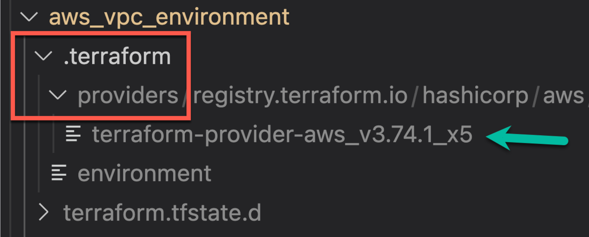

THESE NOTES FOCUSES ON THESE OBJECTIVES--

Objective 1 - Understand Infrastructure as Code Concepts  
Objective 2 - Understand Terraform's Purpose (vs other IaC)  
Objective 3 - Understand Terraform Basics  
Objective 4 - Use Terraform Outside of Core Workflow  
Objective 5 - Interact with Terraform Modules  
Objective 6 - Use the core Terraform workflow  
Objective 7 - Implement and Maintain State  
Objective 8 - Read, Generate, and Modify Configuration

Tips to make sure you clear the exam:  
✅ Hands‑on practice is key. Don’t just read — run Terraform locally:  
Create and destroy resources on a free cloud (AWS free tier works).  
Experiment with remote state in S3 or Terraform Cloud.  
✅ Understand, don’t memorize.  
Why use modules? Why use workspaces? What problem does state solve?  
✅ Use the HashiCorp official study guide:  
✅ Do practice questions.  
Tutorials Dojo, Udemy, or free GitHub question banks.

I HAVE PROVIDED IN‑DEPTH EXPLANATIONS FOR EACH QUESTION, AIMED AT ENHANCING YOUR CONCEPTUAL UNDERSTANDING AND PRACTICAL KNOWLEDGE. ADDITIONALLY, I HAVE INCLUDED THE OFFICIAL TERRAFORM DOCUMENTATION LINKS FOR EACH TOPIC COVERED IN THE QUESTIONS AND DISCUSSIONS, ENSURING YOU CAN EXPLORE FURTHER AND VALIDATE EVERY CONCEPT. I HOPE THESE RESOURCES PROVE VALUABLE AND HELP YOU STRENGTHEN YOUR EXPERTISE, THANKYOU!!

1.  The correct Terraform command to remove the lock on the state for the current configuration is `terraform force-unlock`. This command is specifically designed to force unlock the state file and allow modifications to be made.
    The `terraform force-unlock` command can be used to remove the lock on the Terraform state for the current configuration. Another option is to use the "terraform state rm" command followed by the "terraform state push" command to forcibly overwrite the state on the remote backend, effectively removing the lock. It's important to note that these commands should be used with caution, as they can potentially cause conflicts and data loss if not used properly.

Be very careful forcing an unlock, as it could cause data corruption and problems with your state file.

https://developer.hashicorp.com/terraform/cli/commands/force-unlock

2.  WHY MIGHT A USER OPT TO INCLUDE THE FOLLOWING SNIPPET IN THEIR CONFIGURATION FILE?

```hcl
 terraform {
 required_version = ">= 1.9.2"
 }
```

The snippet specifies the minimum version of Terraform required to run the configuration, ensuring compatibility and preventing potential issues that may arise from using older versions
The required_version parameter in a terraform block is used to specify the minimum version of Terraform that is required to run the configuration. This parameter is optional, but it can be useful for ensuring that a Terraform configuration is only run with a version of Terraform that is known to be compatible.

For example, if your Terraform configuration uses features that were introduced in Terraform 1.9.2, you could include the following terraform block in your configuration to ensure that Terraform 1.9.2 or later is used

https://developer.hashicorp.com/terraform/language/settings#specifying-a-required-terraform-version

3.  Each Terraform workspace uses its own state file to manage the infrastructure associated with that workspace. This allows Terraform to manage multiple sets of infrastructure independently and avoid conflicts. Each Terraform workspace has its own Terraform state file that keeps track of the resources and their attributes, so changes made in one workspace will not affect the infrastructure managed by other workspaces.

In fact, having different state files provides the benefits of workspaces, where you can separate the management of infrastructure resources so you can make changes to specific resources without impacting resources in others....

https://developer.hashicorp.com/terraform/language/state/workspaces#workspace-internals

4.  Understanding how indexes work is essential when working with different variable types and resource blocks that use count or for_each. Therefore, what is the output value of the following code snippet?

```hcl
variable "candy_list" {
type = list(string)
default = ["snickers", "kitkat", "reeces", "m&ms"]
}
```

```hcl
output "give_me_candy" {
value = element(var.candy_list, 2)
}
```

The output value of the code snippet is "reeces" because the element function is used to access the element at index 2 in the candy_list variable, which is "reeces".
In this example, the candy_list variable is a list of strings, and the output block retrieves the third element in the list (at index 2) and outputs it as the value of give_me_candy.

Remember that an index starts at [0], and then counts up. Therefore, the following represents the index value as shown in the variable above:

[0] = snickers

[1] = kitkat

[2] = reeces

[3] = m&ms

https://developer.hashicorp.com/terraform/language/functions/index_function

https://developer.hashicorp.com/terraform/language/functions/element

5.  When using constraint expressions to signify a version of a provider, which of the following are valid provider versions that satisfy the expression found in the following code snippet: (select two)

```hcl
terraform {
  required_providers {
    aws = {
      source  = "hashicorp/aws"
      version = "~> 5.36.0"
    }
  }
}
```

The version "5.36.9" satisfies the constraint expression "~> 5.36.0" as it falls within the same minor version range (5.36.x).
In Terraform, required_providers act as traffic controllers for your infrastructure tools. They ensure all modules use the right versions of providers like AWS or Azure, avoiding compatibility issues and guaranteeing everyone plays by the same rules. Think of them as a clear roadmap for your infrastructure setup, leading to consistent, predictable, and secure deployments.

A version constraint is a string literal containing one or more conditions, which are separated by commas.

Each condition consists of an operator and a version number.

Version numbers should be a series of numbers separated by periods (like 1.2.0), optionally with a suffix to indicate a beta release:

~>: Allows only the rightmost version component to increment. This format is referred to as the pessimistic constraint operator. For example, to allow new patch releases within a specific minor release, use the full version number:

~> 1.0.4: Allows Terraform to install 1.0.5 and 1.0.10 but not 1.1.0.

~> 1.1: Allows Terraform to install 1.2 and 1.10 but not 2.0.

https://developer.hashicorp.com/terraform/language/modules/syntax#version

https://developer.hashicorp.com/terraform/language/expressions/version-constraints#version-constraint-syntax

6.  The terraform state list the command is used in Terraform, an infrastructure-as-code tool, to list all the resources currently being managed by Terraform within a particular state file. This command provides a quick overview of the resources that Terraform is aware of and managing. It's particularly useful for understanding what infrastructure resources have been provisioned and are being tracked by Terraform for any given project or environment.

7.  The correct prefix string for setting input variables using environment variables in Terraform is TF_VAR. This prefix is recognized by Terraform to assign values to variables.
    Terraform allows you to use environment variables to set values in your Terraform configuration. This can be useful for specifying values specific to the environment in which Terraform is running or providing values that can be easily changed without modifying the Terraform configuration.

To use a variable in Terraform, you need to define the variable using the following syntax in your Terraform configuration:

```hcl
variable "instructor_name" {
  type = string
}
```

You can then set the value of the environment variable when you run Terraform by exporting the variable in your shell before running any Terraform commands:

```hcl
$ export TF_VAR_instructor_name="bryan"
$ terraform apply
```

https://developer.hashicorp.com/terraform/cli/config/environment-variables

8.  IaC code is platform-agnostic and can be used to manage infrastructure across various cloud platforms, providing flexibility and scalability in managing resources.
    IaC utilizes a human-readable configuration language, making it easier for developers and operators to understand, write, and maintain infrastructure code efficiently.
    Using Infrastructure as Code (IaC) allows for configurations to be stored in version control, enabling collaboration, tracking changes, and ensuring consistency in infrastructure deployment.
    Infrastructure as Code has many benefits. For starters, IaC allows you to create a blueprint of your data center as code that can be versioned, shared, and reused. Because IaC is code, it can (and should) be stored and managed in a code repository, such as GitHub, GitLab, or Bitbucket. Changes can be proposed or submitted via Pull Requests (PRs), which can help ensure a proper workflow, enable an approval process, and follow a typical development lifecycle.

One of the primary reasons that Terraform (or other IaC tools) are becoming more popular is because they are mostly platform agnostic. You can use Terraform to provision and manage resources on various platforms, SaaS products, and even local infrastructure.

IaC is generally easy to read (and develop). Terraform is written in HashiCorp Configuration Language (HCL), while others may use YAML or solution-specific languages (like Microsoft ARM). But generally, IaC code is easy to read and understand

Incorrect Answer:

IaC is written using a declarative approach (not imperative), which allows users to simply focus on what the eventual target configuration should be, and the tool manages the process of how that happens. This often speeds things up because resources can be created/managed in parallel when there aren't any implicit or explicit dependencies.

https://developer.hashicorp.com/terraform/tutorials/aws-get-started/infrastructure-as-code

https://www.terraform.io/use-cases/infrastructure-as-code

9.  Terraform analyzes any expressions within a resource block to find references to other objects and treats those references as implicit ordering requirements when creating, updating, or destroying resources.
    Terraform resource dependencies control how resources are created, updated, and destroyed. When Terraform creates or modifies resources, it must be aware of any dependencies that exist between those resources. By declaring these dependencies, Terraform can ensure that resources are created in the correct order so that dependent resources are available before other resources that depend on them.

To declare a resource dependency, you can use the depends_on argument in a resource block. The depends_on argument takes a list of resource names and specifies that the resource block in which it is declared depends on those resources.

https://developer.hashicorp.com/terraform/language/resources

10. You are performing a code review of a colleague's Terraform code and see the following code. Where is this module stored?

```hcl
module "vault-aws-tgw" {
source = "terraform/vault-aws-tgw/hcp"
version = "1.0.0"

client_id = "4djlsn29sdnjk2btk"
hvn_id = "a4c9357ead4de"
route_table_id = "rtb-a221958bc5892eade331"
}
```

The code specifies a source from terraform/vault-aws-tgw/hcp, a typical format for modules stored in the Terraform public registry.
You can use the Terraform Public Registry by referencing the modules you want to use in your Terraform code and including them as part of your configuration.

To reference a module from the Terraform Public Registry, you can use the module block in your Terraform code. For example, if you want to use a VPC module from the registry, you would add the following code to your Terraform configuration:

```hcl
module "vpc" {
source = "terraform/aws-modules/vpc"
version = "2.34.0"

# Add any required variables and configuration here

}
```

The source attribute specifies the module source, which is the repository on the Terraform Public Registry. The version attribute specifies the version of the module you want to use.

You can also pass values for variables in the module by using them within the module block. For example:

```hcl
module "vpc" {
  source = "terraform/aws-modules/vpc"
  version = "2.34.0"

  name = "my-vpc"
  cidr = "10.0.0.0/16"
  azs  = ["us-west-2a", "us-west-2b", "us-west-2c"]
}
```

Once you've specified the module in your Terraform code, you can use it as you would any other resource. For example, you could reference the VPC ID created by the VPC module with the following code:

```hcl
output "vpc_id" {
  value = module.vpc.vpc_id
}
```

You can find more information on using modules from the Terraform Public Registry in the Terraform documentation: https://www.terraform.io/docs/configuration/modules.html

11. Anyone can publish and share modules on the Terraform Public Registry, and meeting the requirements for publishing a module is extremely easy.

What are some of the requirements that must be met in order to publish a module on the Terraform Public Registry?
(Any Three)

a.The module must be on GitHub and must be a public repo.
b.Module repositories must use this three-part name format, terraform-<PROVIDER>-<NAME>.
c.The registry uses tags to identify module versions. Release tag names must be for the format x.y.z, and can optionally be prefixed with a v .
The requirement for release tag names to follow the x.y.z format and optionally be prefixed with a 'v' is valid, as it ensures consistency and clarity in versioning for modules on the Terraform Public Registry.
x.y.z tags for releases. The registry uses tags to identify module versions. Release tag names must be a semantic version, which can optionally be prefixed with a v. For example, v1.0.4 and 0.9.2. To publish a module initially, at least one release tag must be present. Tags that don't look like version numbers are ignored.

https://developer.hashicorp.com/terraform/registry/modules/publish#requirements

12. The terraform state command can indeed be used to modify the current state by removing items. This is useful for managing the state of resources in Terraform.
    The terraform state command and its subcommands can be used for various tasks related to the Terraform state. Some of the tasks that can be performed using the terraform state command are:

Inspecting the Terraform state: The terraform state show subcommand can be used to display the current state of a Terraform configuration. This can be useful for verifying the current state of resources managed by Terraform.

Updating the Terraform state: The terraform state mv and terraform state rm subcommands can be used to move and remove resources from the Terraform state, respectively.

Pulling and pushing the Terraform state: The terraform state pull and terraform state push subcommands can be used to retrieve and upload the Terraform state from and to a remote backend, respectively. This is useful when multiple users or systems are working with the same Terraform configuration.

Importing resources into Terraform: The terraform state import subcommand can be used to import existing resources into the Terraform state. This allows Terraform to manage resources that were created outside of Terraform.

By using the terraform state command and its subcommands, users can manage and manipulate the Terraform state in various ways, helping to ensure that their Terraform configurations are in the desired state.

https://developer.hashicorp.com/terraform/cli/commands/state/list

https://developer.hashicorp.com/terraform/cli/state

13. Terraform can be expressed in JSON syntax in addition to HCL. JSON is a popular choice for configuration files due to its simplicity and compatibility with various systems.
    Terraform can be expressed using two syntaxes: HashiCorp Configuration Language (HCL), which is the primary syntax for Terraform, and JSON.

The HCL syntax is designed to be human-readable and easy to write, and it provides many features designed explicitly for Terraform, such as interpolation, variables, and modules.

The JSON syntax is a machine-readable alternative to HCL, and it is typically used when importing existing infrastructure into Terraform or when integrating Terraform with other tools that expect data in JSON format.

While Terraform will automatically detect the syntax of a file based on its extension, you can also specify the syntax explicitly by including a terraform stanza in the file, as follows:

```hcl
# HCL syntax Example

# terraform { }

# JSON syntax Exmample

{
"terraform": {}
}
```

Note that while JSON is supported as a syntax, it is not recommended to use it for writing Terraform configurations from scratch, as the HCL syntax is more user-friendly and provides better support for Terraform's specific features.

https://github.com/hashicorp/hcl/blob/main/hclsyntax/spec.md

https://developer.hashicorp.com/terraform/language/syntax/json

14. In the example below, the depends_on argument creates what type of dependency?

```hcl
resource "aws_instance" "example" {
  ami           = "ami-2757f631"
  instance_type = "t2.micro"
  depends_on    = [aws_s3_bucket.company_data]
}
```

The `depends_on` argument in Terraform creates an explicit dependency between resources. This means that Terraform will wait for the specified resource to be created or updated before proceeding with the dependent resource.
Explicit dependencies in Terraform are dependencies that are explicitly declared in the Terraform configuration. These dependencies are used to control the order in which Terraform creates, updates, and destroys resources.

In Terraform, you can declare explicit dependencies using the depends_on argument in a resource block. The depends_on argument takes a list of resource names and specifies that the resource block in which it is declared depends on those resources.

For example, consider a scenario where you have a virtual machine (VM) that depends on a virtual network (VNET) and a subnet. You can declare these dependencies using the depends_on argument as follows:

```hcl

resource "azurerm_virtual_network" "vnet" {
  name                = "example-vnet"
  address_space       = ["10.0.0.0/16"]
}

resource "azurerm_subnet" "subnet" {
  name                 = "example-subnet"
  virtual_network_name = azurerm_virtual_network.vnet.name
  address_prefix       = "10.0.1.0/24"
}

resource "azurerm_network_interface" "nic" {
  name                = "example-nic"
  location            = azurerm_virtual_network.vnet.location
  subnet_id           = azurerm_subnet.subnet.id
  depends_on = [
    azurerm_subnet.subnet,
    azurerm_virtual_network.vnet
  ]
}
```

In this example, the azurerm_network_interface resource depends on both the azurerm_subnet and the azurerm_virtual_network resources, so Terraform will create those resources first, and then create the azurerm_network_interface resource.

By declaring explicit dependencies, you can ensure that Terraform creates resources in the correct order, so that dependent resources are available before other resources that depend on them. This helps prevent errors or unexpected behavior when creating or modifying infrastructure, and makes it easier to manage and understand the relationship between resources.

Overall, the use of explicit dependencies is a critical aspect of Terraform, as it helps ensure that resources are created and managed in the correct order and makes it easier to manage and understand the relationship between resources.
https://learn.hashicorp.com/tutorials/terraform/dependencies

15. You are using Terraform to deploy some cloud resources and have developed the following code. However, you receive an error when trying to provision the resource.fixes the syntax of the Terraform code?
    Write the code which fixes the syntax of the Terraform code?

```hcl
    resource "aws_security_group" "vault_elb" {
  name        = "${var.name_prefix}-vault-elb"
  description = Vault ELB
  vpc_id      = var.vpc_id
}
```

corrected code👇

```hcl
resource "aws_security_group" "vault_elb" {
name = "${var.name_prefix}-vault-elb"
description = "Vault ELB"
vpc_id = var.vpc_id
}
```

The syntax error in the original code is that the description value is missing quotation marks. By adding the quotes around "Vault ELB", the code will be corrected and the provisioning process will not throw an error.
When assigning a value to an argument in Terraform, there are a few requirements that must be met:

Data type: The value must be of the correct data type for the argument. Terraform supports several data types, including strings, numbers, booleans, lists, and maps.

Value constraints: Some arguments may have specific value constraints that must be met. For example, an argument may only accept values within a certain range or values from a specific set of values.

When assigning a value to an argument expecting a string, it must be enclosed in quotes ("...") unless it is being generated programmatically.

https://developer.hashicorp.com/terraform/language/syntax/configuration#arguments-and-blocks

16. True or False? Rather than use a state file, Terraform can inspect cloud resources on every run to validate that the real-world resources match the desired state.
    False. Terraform requires a state file to store information about the current state of infrastructure resources. By inspecting this state file, Terraform can determine the necessary changes to bring the real-world resources in line with the desired state specified in the configuration files. Without a state file, Terraform would not be able to perform this validation.
    State is a necessary requirement for Terraform to function. And in the scenarios where Terraform may be able to get away without state, doing so would require shifting massive amounts of complexity from one place (state) to another place (the replacement concept).

To support mapping configuration to resources in the real world, Terraform uses its own state structure. Terraform can guarantee one-to-one mapping when it creates objects and records their identities in the state. Terraform state also serves as a performance improvement - rather than having to scan every single resource to determine the current state of each resource.

https://developer.hashicorp.com/terraform/language/state/purpose

17. True or False? When using the Terraform provider for Vault, the tight integration between these HashiCorp tools provides the ability to mask secrets in the state file.
    False. The statement is false because the tight integration between Terraform and Vault does not automatically mask secrets in the state file. Developers need to implement secure practices to handle secrets effectively.
    By default, Terraform does not provide the ability to mask secrets in the Terraform plan and state files regardless of what provider you are using. While Terraform and Vault are both developed by HashiCorp and have a tight integration, masking secrets in Terraform plans and state files requires additional steps to securely manage sensitive information.

One common approach is to use environment variables to store sensitive information or use Terraform's data sources to retrieve the information from the environment rather than hardcoding the information into the Terraform configuration. This helps to ensure that sensitive information is not stored in plain text in the Terraform configuration files.

https://learn.hashicorp.com/tutorials/terraform/secrets-vault

18. HashiCorp recommends using 2 spaces between each nesting level in Terraform code for better readability and maintainability.
    HashiCorp, the creator of Terraform, recommends using two spaces for indentation when writing Terraform code. This is a convention that helps to improve readability and consistency across Terraform configurations.

For example, when defining a resource in Terraform, you would use two spaces to indent each level of the resource definition, as in the following example:

```hcl

resource "aws_instance" "example" {
  ami           = "ami-0c55b159cbfafe1f0"
  instance_type = "t2.micro"

  tags = {
    Name = "example-instance"
  }
}
```

While this is the recommended convention, it is not a strict requirement and Terraform will still function correctly even if you use a different number of spaces or a different type of indentation. However, using two spaces for indentation is a widely adopted convention in the Terraform community and is recommended by HashiCorp to improve the readability and maintainability of your Terraform configurations.

Check this link for more information - https://developer.hashicorp.com/terraform/language/style

19. What do the declarations, such as name, cidr, and azs, in the following Terraform code represent and what purpose do they serve?

```hcl
module "vpc" {
  source  = "terraform-aws-modules/vpc/aws"
  version = "5.7.0"

  name = var.vpc_name
  cidr = var.vpc_cidr

  azs             = var.vpc_azs
  private_subnets = var.vpc_private_subnets
  public_subnets  = var.vpc_public_subnets

  enable_nat_gateway = var.vpc_enable_nat_gateway

  tags = var.vpc_tags
}
```

The declarations like name, cidr, and azs are variables that are being passed into the child module for resource creation. These variables allow for customization and flexibility in configuring the VPC module according to specific requirements.
To pass values to a Terraform module when calling the module in your code, you use input variables. Input variables are a way to pass values into a Terraform module from the calling code. They allow the module to be flexible and reusable, as the same module can be used with different input values in different contexts.

In this example, the values for the name, cidr, and azs inputs are passed to the module as values of variables. The variables are defined in the calling code in the calling module using the variable block.

To pass the values to the module, you can specify them in a number of ways, such as:

Using command-line flags when running Terraform

Storing the values in a Terraform .tfvars file and passing that file to Terraform when running it

Using environment variables

For more information on Terraform modules and input variables, I recommend checking out the Terraform documentation: https://www.terraform.io/docs/modules/index.html

https://learn.hashicorp.com/tutorials/terraform/module-use#set-values-for-module-input-variables

20. Harry has deployed resources on Azure using Terraform. However, he has discovered that his co-workers Ron and Ginny have manually created a few resources using the Azure console. Since it is company policy to manage production workloads using IaC, how can Harry bring these resources under Terraform management without negatively impacting the availability of the deployed resources?

Using `terraform import` or the `import` block allows Harry to bring the existing resources under Terraform management without disrupting the availability of the deployed resources. This method ensures that the resources are managed by Terraform while preserving their current state.
To manage the resources created manually by Ron and Ginny in Terraform without negatively impacting the availability of the deployed resources, Harry can follow the steps below:

-- Import the existing resources: Harry can use the terraform import command to import the existing resources into Terraform. The terraform import command allows you to import existing infrastructure into Terraform, creating a Terraform state file for the resources. You can also create an import block to pull in resources under Terraform management.

-- Modify the Terraform configuration: After importing the resources, Harry can modify the Terraform configuration to reflect the desired state of the resources. This will allow him to manage the resources using Terraform just like any other Terraform-managed resource

-- Test the changes: Before applying the changes, Harry can use the terraform plan command to preview the changes that will be made to the resources. This will allow him to verify that the changes will not negatively impact the availability of the resources.

-- Apply the changes: If the changes are correct, Harry can use the terraform apply command to apply the changes to the resources.

By following these steps, Harry can start managing the manually created resources in Terraform while ensuring that the availability of the deployed resources is not impacted.

The terraform import command is used to import existing resources into Terraform. This allows you to take resources that you’ve created by some other means and bring them under Terraform management.

Note that terraform import DOES NOT generate configuration, it only modifies state. You'll still need to write a configuration block for the resource for which it will be mapped using the terraform import command.

https://developer.hashicorp.com/terraform/language/import

https://developer.hashicorp.com/terraform/cli/commands/import

21. In order to reduce the time it takes to provision resources, Terraform uses parallelism. By default, how many resources will Terraform provision concurrently during a `terraform apply`?

Terraform by default provisions 10 resources concurrently during a `terraform apply` command to speed up the provisioning process and reduce the overall time taken.
By default, Terraform will provision resources concurrently with a maximum of 10 concurrent resource operations. This setting is controlled by the parallelism configuration option in Terraform, which can be set globally in the Terraform configuration file or on a per-module basis.

The parallelism setting determines the number of resource operations that Terraform will run in parallel, so increasing the parallelism setting will result in Terraform provisioning resources more quickly, but can also increase the risk of rate-limiting or other errors from the API.

You can adjust the parallelism setting in your Terraform configuration file by adding the following code:

```hcl
terraform {
  parallelism = 20
}
```

This setting sets the maximum number of concurrent resource operations to 10. You can adjust this number to meet your specific needs and constraints.

https://developer.hashicorp.com/terraform/internals/graph#walking-the-graph

22. You are adding a new variable to your configuration. Which of the following is NOT a valid variable type in Terraform?
    The Terraform language uses the following types for its values: string, number, bool, list (or tuple), map (or object). There are no other supported variable types in Terraform, therefore, float is NOT a valid variable type in Terraform.

Don't forget that variable types are included in a variable block, but they are NOT required since Terraform interprets the type from a default value or value provided by other means (ENV, CLI flag, etc)

```hcl
variable "practice-exam" {
  description = "bryan's terraform associate practice exams"
  type        = string
  default     = "highly-rated"
}
```

https://developer.hashicorp.com/terraform/language/expressions/types

Addon 👇
The variable type `number` is a valid type in Terraform. Numbers are used to represent numerical values in Terraform configurations.
The variable type `bool` is a valid type in Terraform. Booleans are used to represent true or false values in Terraform configurations.
The variable type `string` is a valid type in Terraform. Strings are commonly used for representing text values in Terraform configurations.
The variable type `map` is a valid type in Terraform. Maps are used to define key-value pairs in Terraform configurations.
In Terraform, the variable type `float` is not a valid type. Terraform supports variable types such as `string`, `map`, `bool`, and `number`, but not `float`

23. A user runs terraform init on their RHEL-based server, and per the output, two provider plugins are downloaded:

```hcl

$ terraform init

Initializing the backend...

Initializing provider plugins...
- Checking for available provider plugins...
- Downloading plugin for provider "aws" (hashicorp/aws) 2.44.0...
- Downloading plugin for provider "random" (hashicorp/random) 2.2.1...

Terraform has been successfully initialized!
```

Where are these plugins downloaded and stored on the server?

The provider plugins are downloaded and stored in the `.terraform/providers` directory within the current working directory. This directory is specifically used by Terraform to manage provider plugins.
By default, terraform init downloads plugins into a subdirectory of the working directory,
`.terraform/providers` so that each working directory is self-contained.


https://developer.hashicorp.com/terraform/plugin#installing-plugins

24. You are using an HCP Terraform workspace linked to a GitHub repo to manage production workloads in your environment. After approving a merge request, what default action can you expect to be triggered on the workspace?

A speculative plan will be run to show the potential changes to the managed environment and validate the changes against any applicable Sentinel policies
After approving a merge request, HCP Terraform will run a speculative plan to show the potential changes that will be applied to the managed environment. This allows users to review and validate the changes against any applicable Sentinel policies before applying them.
After approving a merge request that modifies Terraform configurations in a GitHub repository linked to an HCP Terraform workspace, the default action that can be expected to run automatically is a "speculative plan" operation.

When you merge a pull request or push changes to the main branch (or any branch you have configured as the trigger for the workspace), HCP Terraform typically triggers a plan operation. During this plan phase, Terraform examines the proposed changes to your infrastructure and displays a list of actions it would take if applied. It's a way to preview the changes before actually making them.

The plan output shows what resources Terraform would create, modify, or delete, which allows you to review and validate the expected changes. After reviewing the plan, you can then manually apply the changes to your infrastructure through the HCP Terraform workspace.

Note: You can absolutely configure a Terraform workspace to automatically apply the changes to the code, although that is generally not recommended, nor is it the default action.

Wrong Answers:

- HCP Terraform does not automatically run a speculative plan and apply the changes unless you specifically configure the workspace to do so. This is not the default action that would be triggered when you commit new code to the repo

- HCP Terraform does not run external tests, such as terratest and terraform validate on your code when you commit it to a repo

- HCP Terraform, or Terraform in general, does not destroy managed infrastructure when executing a plan and apply. It will only modify the resources needed to ensure the managed restructure now matches the desired state.

https://developer.hashicorp.com/terraform/cloud-docs/run/remote-operations

25. When multiple arguments with single-line values appear on consecutive lines at the same nesting level, HashiCorp recommends that you:

put arguments in alphabetical order

```hcl
name = "www.example.com"
records = [aws_eip.lb.public_ip]
type = "A"
ttl = "300"
zone_id = aws_route53_zone.primary.zone_id
```

HashiCorp recommends aligning the equals signs for better readability and consistency in the code. This helps in quickly identifying and understanding the key-value pairs in the configuration.

```hcl
#align the equals signs


ami           = "abc123"
instance_type = "t2.micro"
```

HashiCorp style conventions suggest that you align the equals sign for consecutive arguments for easing readability for configurations:

```hcl
ami           = "abc123"
instance_type = "t2.micro"
subnet_id     = "subnet-a6b9cc2d59cc"

```

Notice how the equal (=) signs are aligned, even though the arguments are of different lengths.

https://developer.hashicorp.com/terraform/language/syntax/style

26. True or False? The following code is an example of an implicit dependency in Terraform

```hcl

resource "aws_instance" "web" {
  ami           = "ami-0c55b159cbfafe1f0"
  instance_type = "t2.micro"
}

resource "aws_ebs_volume" "data" {
  availability_zone = "us-west-2a"
  size              = 1

  tags = {
    Name = "data-volume"
  }
}

resource "aws_volume_attachment" "attach_data_volume" {
  device_name = "/dev/xvdf"
  volume_id   = aws_ebs_volume.data.id
  instance_id = aws_instance.web.id
}
```

True--
The code snippet provided shows an implicit dependency in Terraform. The resource `"aws_volume_attachment"` `"attach_data_volume"` depends on both `"aws_ebs_volume.data"` and `"aws_instance.web"` resources without explicitly specifying the dependency using the `"depends_on"`attribute. Terraform automatically detects this relationship and ensures that the dependencies are resolved in the correct order during the execution.

Terraform implicit dependencies refer to the dependencies between resources in a Terraform configuration but are not explicitly defined in the configuration. Terraform uses a graph to track these implicit dependencies and ensures that resources are created, updated, and deleted in the correct order.

For example, suppose you have a Terraform configuration that creates a virtual machine and a disk. In that case, Terraform will implicitly depend on the disk being created before the virtual machine because the virtual machine needs the disk to function. Terraform will automatically create the disk first and then create the virtual machine.

Sometimes, Terraform may miss an implicit dependency, resulting in an error when you run terraform apply. In these cases, you can use the `depends_on` argument to explicitly declare the dependency between resources. For example:

```hcl
resource "aws_instance" "example" {
  ami           = "ami-0c55b159cbfafe1f0"
  instance_type = "t2.micro"

  depends_on = [
    aws_ebs_volume.example
  ]
}

resource "aws_ebs_volume" "example" {
  availability_zone = "us-west-2a"
  size              = 1
}
```

In this example, the aws_instance resource depends on the `aws_ebs_volume` resource, and Terraform will create the `aws_ebs_volume` resource first and then the `aws_instance` resource.

In general, Terraform implicit dependencies are handled automatically, but sometimes it may be necessary to use the `depends_on` argument to ensure that resources are created in the correct order.

https://developer.hashicorp.com/terraform/tutorials/certification-associate-tutorials-003/dependencies

27. Which code snippet would allow you to retrieve information about existing resources and use that information within your Terraform configuration?

```hcl
module "deploy-servers" {
  source  = "./app-cluster"

  servers = 5
}
```

A.

```hcl
module "deploy-servers" {
  source  = "./app-cluster"

  servers = 5
}
```

Explanation
This code snippet defines a module block for deploying servers from a specified source. While modules are useful for organizing and reusing Terraform configurations, this snippet does not focus on retrieving information about existing resources for use in the configuration.

B. `Correct answer`

```hcl
data "aws_ami" "aws_instance" {
most_recent = true

owners = ["self"]
tags = {
Name = "app-server"
Tested = "true"
}
}
```

Explanation
This code snippet defines a data block for retrieving information about an AWS AMI (Amazon Machine Image) based on specific criteria like owners and tags. This data can then be used within the Terraform configuration to make decisions or set attributes based on the retrieved information.

C.

```hcl
provider "google" {
project = "acme-app"
region = "us-central1"
}
```

Explanation
This code snippet defines a provider block for Google Cloud Platform, specifying the project and region. While providers are essential for interacting with cloud platforms, this snippet does not directly address retrieving information about existing resources for use in Terraform configuration.

D.

```hcl
resource "aws_instance" "web" {
ami = "ami-a1b2c3d4"
instance_type = "t2.micro"
}
```

Explanation
This code snippet defines a resource block for creating an AWS EC2 instance with specific attributes like AMI and instance type. While creating new resources is a common task in Terraform, this snippet does not address retrieving information about existing resources for use in the configuration.

E.

```hcl
locals {
service_name = "forum"
owner = "Community Team"
}
```

Explanation
This code snippet defines local values for service_name and owner, which can be used for storing and reusing values within the Terraform configuration. However, it does not directly involve retrieving information about existing resources for use in the configuration.

Overall explanation--
In Terraform, data blocks are used to retrieve data from external sources, such as APIs or databases, and make that data available to your Terraform configuration. With data blocks, you can use information from external sources to drive your infrastructure as code, making it more dynamic and flexible.

For example, you can use a data block to retrieve a list of Amazon Machine Images (AMIs) from AWS, and then use that data to select the appropriate AMI for a virtual machine you are provisioning:

```hcl
data "aws_ami" "example" {
most_recent = true

filter {
name = "name"
values = ["amzn2-ami-hvm-2.0.*-x86_64-gp2"]
}

filter {
name = "virtualization-type"
values = ["hvm"]
}
}

resource "aws_instance" "example" {
ami = data.aws_ami.example.id
instance_type = "t2.micro"
}
```

In this example, the data block retrieves the most recent Amazon Linux 2 HVM AMI, and the `aws_instance` resource uses the selected AMI to create a virtual machine.

Data blocks can be used to retrieve information from a wide range of sources, such as databases, APIs, and cloud providers. This information can then be used to conditionally create, update, or delete resources, making your Terraform configurations more flexible and adaptable to changing requirements.

https://developer.hashicorp.com/terraform/language/data-sources

28. The private registry feature in HCP Terraform allows users to publish and maintain custom modules within their organization, providing a secure and controlled environment for sharing infrastructure configurations.

Overall explanation
You can use modules from a private registry, like the one provided by HCP Terraform. Private registry modules have source strings of the form <HOSTNAME>/<NAMESPACE>/<NAME>/<PROVIDER>. This is the same format as the public registry but with an added hostname prefix.

https://www.datocms-assets.com/2885/1602500234-terraform-full-feature-pricing-tablev2-1.pdf

29. Freddy and his co-worker Jason are deploying resources in GCP using Terraform for their team. After resources have been deployed, they must destroy the cloud-based resources to save on costs. However, two other team members, Michael and Chucky, are using a Cloud SQL instance for testing and request to keep it running.
    How can Freddy and Jason destroy all other resources without negatively impacting the database?

-- Run a `terraform state rm` command to remove the Cloud SQL instance from Terraform management before running the terraform destroy command

Explanation--
Removing the Cloud SQL instance from Terraform management using the `terraform state rm` command ensures that the instance is not included in the resources to be destroyed when running `terraform destroy`. This allows Freddy and Jason to delete all other resources without impacting the database.

Overall explanation--
To destroy all Terraform-managed resources except for a single resource, you can use the terraform state command to remove the state for the resources you want to preserve. This effectively tells Terraform that those resources no longer exist, so it will not attempt to destroy them when you run terraform destroy.

Here's an example of how you could do this:

- Identify the resource you want to preserve. In this example, let's assume you want to preserve a resource named prod_db.

- Run terraform state list to see a list of all Terraform-managed resources.

- Run terraform state rm for each resource you want to keep, like the prod_db. For example:

```hcl
        terraform state rm google_sql_database_instance.prod_db
        terraform state rm aws_instance.another_instance
```

- Run terraform destroy to destroy all remaining resources. Terraform will not attempt to destroy the resource you preserved in step 3 because Terraform no longer manages it.

Note that this approach can be dangerous and is not recommended if you have multiple Terraform workspaces or if you are using a remote state backend, as it can cause inconsistencies in your state file. In those cases, it is usually better to use a separate Terraform workspace for the resources you want to preserve or to utilize Terraform's built-in resource-targeting functionality to destroy only specific resources.

All other options would be too time-consuming or will cause an outage to the database.

https://developer.hashicorp.com/terraform/cli/commands/state/rm

30. True or False? Using the latest versions of Terraform, terraform init cannot automatically download community providers.

(image-1.png)

-- False

Explanation-
The statement "False" is correct because using the latest versions of Terraform, the command `terraform init` can automatically download community providers. This functionality simplifies the process of integrating community providers into Terraform configurations, enhancing the overall user experience.

Overall explanation-
With the latest versions of Terraform, terraform init can automatically download community providers. More specifically, this feature was added with Terraform 0.13. Before 0.13, terraform init would NOT download community providers.

Terraform includes a built-in provider registry that allows you to easily install and manage the providers you need for your Terraform configuration. When you run terraform init, Terraform will check your configuration for any required providers and download them automatically if they are not already installed on your system. This includes both official Terraform providers and community-maintained providers.

To use a community-maintained provider in your Terraform configuration, you need to specify the provider in your configuration using the provider block and include the provider's source repository in your configuration. Terraform will download and install the provider automatically when you run terraform init, provided that the provider is available in the Terraform provider registry.

https://www.hashicorp.com/blog/automatic-installation-of-third-party-providers-with-terraform-0-13

31. What Terraform command will launch an interactive console to evaluate and experiment with expressions?

-- `terraform console`
The correct Terraform command to launch the Interactive console is "terraform console". This command allows users to evaluate and experiment with expressions in an interactive manner.
The terraform console command in Terraform is a command-line interface (CLI) tool that allows you to interactively evaluate expressions in Terraform. The terraform console command opens a REPL (Read-Eval-Print Loop) environment, where you can type Terraform expressions and see the results immediately. This can be useful for testing and debugging Terraform configurations and understanding how Terraform evaluates expressions.

Here are a few examples of how the terraform console command can be helpful:

- Testing expressions: You can use the terraform console command to test Terraform expressions and see the results immediately. For example, you can test arithmetic operations, string concatenation, and other Terraform expressions to ensure that they are evaluated correctly.

- Debugging configurations: If you have a complex Terraform configuration and you're not sure why it's not working as expected, you can use the terraform console command to debug the configuration by testing expressions and variables to see their values.

- Understanding Terraform behavior: If you're new to Terraform and you want to understand how it evaluates expressions and variables, you can use the terraform console command to explore Terraform's behavior and see how different expressions are evaluated.

To use the `terraform console` command, simply type terraform console in your terminal, and Terraform will open a REPL environment. You can then type Terraform expressions and see the results immediately. You can exit the REPL environment by typing exit or quit.

It's worth noting that the terraform console command operates in the context of a specific Terraform configuration, so you should run the command from within the directory that contains your Terraform configuration files.

https://developer.hashicorp.com/terraform/cli/commands/console

32. Which Terraform command will check and report errors within modules, attribute names, and value types to ensure they are syntactically valid and internally consistent?

`terraform show`
`terraform format`
`terraform validate`
`terraform fmt`

--
The correct choice is `terraform validate` because this command is specifically designed to check and report errors within modules, attribute names, and value types to ensure they are syntactically valid and internally consistent.

The `terraform validate` command is used to check and report errors within modules, attribute names, and value types to ensure they are syntactically valid and internally consistent. This command performs basic validation of the Terraform configuration files in the current directory, checking for issues such as missing required attributes, invalid attribute values, and incorrect structure of the Terraform code.

For example, if you run terraform validate and there are syntax errors in your Terraform code, Terraform will display an error message indicating the line number and description of the issue. If no errors are found, the command will return with no output.

It's recommended to run terraform validate before running terraform apply, to ensure that your Terraform code is valid and will not produce unexpected results.

https://developer.hashicorp.com/terraform/cli/commands/validate

AddOns-

`terraform show`
Explanation
The choice `terraform show` is incorrect as this command is used to provide human-readable output from a state or plan file. It does not perform validation checks for errors within modules, attribute names, and value types.

`terraform format`
Explanation
The choice `terraform format` is incorrect as this command is not a valid Terraform command. The correct command for formatting Terraform configuration files is terraform fmt.

`terraform fmt`
Explanation
The choice `terraform fmt` is incorrect as this command is used to rewrite Terraform configuration files to a canonical format and style. It does not check for errors within modules, attribute names, and value types.

33. After many years of using Terraform Community (Free), you decide to migrate to HCP Terraform. After the initial configuration, you create a workspace and migrate your existing state and configuration. What Terraform version would the new workspace be configured to use after the migration?

--The new workspace in HCP Terraform will be configured to use the same Terraform version that was used to perform the migration. This ensures compatibility and consistency with the existing state and configuration.
When you create a new workspace, HCP Terraform automatically selects the most recent version of Terraform available. If you migrate an existing project from the CLI to HCP Terraform, HCP Terraform configures the workspace to use the same version as the Terraform binary you used when migrating. HCP Terraform lets you change the version a workspace uses on the workspace's settings page to control how and when your projects use newer versions of Terraform.

It's worth noting that HCP Terraform also provides the ability to upgrade your Terraform version in a controlled manner. This allows you to upgrade your Terraform version in a safe and predictable way, without affecting your existing infrastructure or state.

https://developer.hashicorp.com/terraform/tutorials/cloud/cloud-versions

34. A "backend" in Terraform determines how state is loaded and how an operation such as apply is executed. Which of the following is not a supported backend type?

github Local S3 consul

-- GitHub is not a supported backend type.

The Terraform backend is responsible for storing the state of your Terraform infrastructure and ensuring that state is consistent across all team members. Terraform state is used to store information about the resources that Terraform has created, and is used by Terraform to determine what actions are necessary when you run Terraform commands like apply or plan.

Terraform provides several backend options, including:

local backend: The default backend, which stores Terraform state on the local filesystem. This backend is suitable for small, single-user deployments, but can become a bottleneck as the size of your infrastructure grows or as multiple users start managing the infrastructure.

remote backend: This backend stores Terraform state in a remote location, such as an S3 bucket, a Consul server, or a Terraform Enterprise instance. The remote backend allows multiple users to share the same state and reduces the risk of state corruption due to disk failures or other issues.

consul backend: This backend stores Terraform state in a Consul cluster. Consul provides a highly available and durable storage solution for Terraform state, and also provides features like locking and versioning that are important for collaboration.

s3 backend: This backend stores Terraform state in an S3 bucket. S3 provides a highly available and durable storage solution for Terraform state, and is a popular option for storing Terraform state for large infrastructure deployments.

When choosing a backend, you should consider the needs of your infrastructure, including the size of your deployment, the number of users who will be managing the infrastructure, and the level of collaboration that will be required. It's also important to consider the cost and performance characteristics of each backend, as some backends may be more expensive or may require more setup and maintenance than others.

https://developer.hashicorp.com/terraform/language/settings/backends/configuration

35. You are writing Terraform to deploy resources, and have included provider blocks as shown below:

```hcl
provider "aws" {
  region  = "us-east-1"
}

provider "aws" {
  region = "us-west-1"
}
```

When you validate the Terraform configuration, you get the following error:

```hcl
Error: Duplicate provider configuration

  on main.tf line 5:
   5: provider "aws" {

A default provider configuration for "aws" was already given at
main.tf:1,1-15. If multiple configurations are required, set the xxxx
argument for alternative configurations.
```

What additional parameter is required to use multiple provider blocks of the same type, but with distinct configurations, such as cloud regions, namespaces, or other desired settings?

-- `alias`
The correct additional parameter required to use multiple provider blocks of the same type with distinct configurations is the "alias" parameter. This allows you to differentiate between the different configurations of the same provider type.
An alias meta-argument is used when using the same provider with different configurations for different resources. This feature allows you to include multiple provider blocks that refer to different configurations. In this example, you would need something like this:

```hcl
provider "aws" {
  region  = "us-east-1"
}

provider "aws" {
  region = "us-west-1"
  alias = "west"
}
```

When writing Terraform code to deploy resources, the resources that you want to deploy to the "west" region would need to specify the alias within the resource block. This instructs Terraform to use the configuration specified in that provider block. So in this case, the resource would be deployed to "us-west-2" region and not the "us-east-1" region. this configuration is common when using multiple cloud regions or namespaces in applications like Consul, Vault, or Nomad.

https://developer.hashicorp.com/terraform/language/providers/configuration#alias-multiple-provider-instances

AddOns-
`multi`
Explanation
The "multi" parameter is not a valid parameter in Terraform for defining multiple configurations of the same provider type. The correct parameter to achieve this is the "alias" parameter.

`version`
Explanation
The "version" parameter is not used to define multiple configurations of the same provider type in Terraform. It is typically used to specify the version of the provider being used.

`label`
Explanation
The "label" parameter is not a valid parameter in Terraform for defining multiple configurations of the same provider type. To differentiate between configurations, the "alias" parameter should be used.

36. You and a colleague are working on updating some Terraform configurations within your organization. You need to follow a new naming standard for the local name within your resource blocks. However, you don't want Terraform to replace the object after changing your configuration files.

As an example, you want to change `data-bucket` to now be `prod-encrypted-data-s3-bucket` in the following resource block:

```hcl
resource "aws_s3_bucket" "data-bucket" {
bucket = "corp-production-data-bucket"

tags = {
Name = "corp-production-data-bucket"
Environment = "prod"
}
}
```

After updating the resource block, what command would you run to update the local name while ensuring Terraform does not replace the existing resource?

--

`terraform state mv aws_s3_bucket.data-bucket aws_s3_bucket.prod-encrypted-data-s3-bucket`

Explanation
The correct command to update the local name without replacing the existing resource is to use the `terraform state mv` command. This command will move the existing state object to the new local name specified, ensuring that Terraform does not replace the resource.
You can use terraform state mv when you wish to retain an existing remote object but track it as a different resource instance address in Terraform, such as if you have renamed a resource block or you have moved it into a different module in your configuration.

In this case, Terraform would not touch the actual resource that is deployed, but it would simply attach the existing object to the new address in Terraform.

WRONG ANSWERS:

`terraform apply - replace` - this would cause Terraform to replace the resource

`terraform apply - refresh-only` - this command is used to reconcile any changes to the real-world resources and update state to reflect those changes. It would not help us solve our problem

`terraform state rm` - This command is used to remove a resource from state entirely while leaving the real-world resource intact. The bucket would still exist but it wouldn't help us with renaming our resource in our configuration file.

https://developer.hashicorp.com/terraform/cli/commands/state/mv#usage

AddOns-
`terraform apply -refresh-only`
The `terraform apply -refresh-only` command is not the correct option for updating the local name without replacing the existing resource. This command is used to only refresh the state of the resources without making any changes to the infrastructure.

`terraform state rm aws_s3_bucket.data-bucket`
The `terraform state rm` command is not the correct option for updating the local name without replacing the existing resource. This command is used to remove a resource from the Terraform state, which is not the desired action in this situation where the goal is to update the local name without replacing the resource.

`terraform apply -replace aws_s3_bucket.data-bucket`
The `terraform apply -replace` command is not the correct option for updating the local name without replacing the existing resource. This command is used to force Terraform to replace a specific resource during the apply process, which is not the desired outcome in this scenario.

37.
